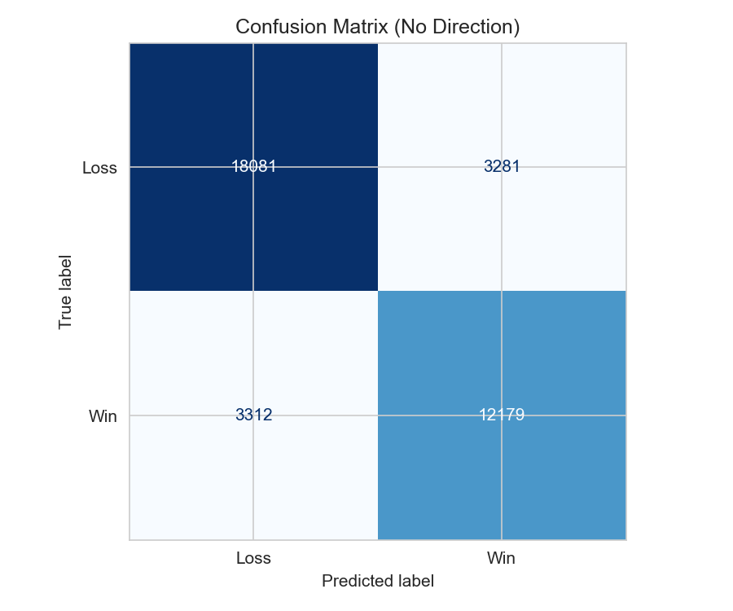
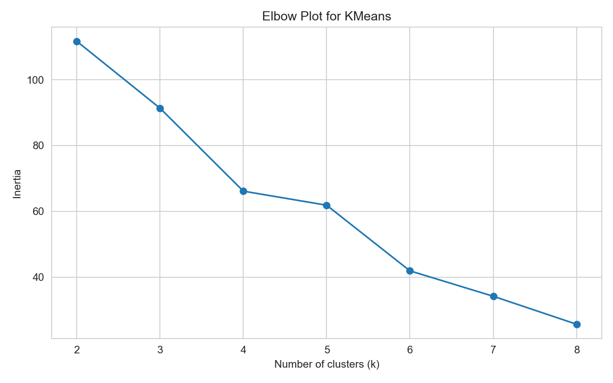

# Crypto Trader Sentiment Analysis

Short research notebook on how Bitcoin Fear and Greed relates to trading behavior on Hyperliquid. Focus is on behavior patterns, not market prediction.

## What Was Done
- Merged daily sentiment with trade-level history
- Analyzed profitability patterns and skewness
- Compared fear vs greed behavior
- Clustered trader types with KMeans
- Built a Random Forest classifier
- Detected and mitigated feature leakage

## Model Evaluation
- Baseline (majority class) accuracy: ~0.58
- Random Forest (no Direction): ~0.82 accuracy
- Precision/recall roughly balanced (~0.79 / ~0.79)
- Leakage note: `Direction` removed to avoid inflated scores
- Confusion matrix included below

## Clustering Note
- Elbow plot suggested k=4 as a reasonable trade-off
- Clusters separate high-frequency accounts from large-size accounts

## Key Results
- Profitability is heavily skewed to a small set of trades
- Greed regimes show fatter tails in trade sizing
- Sentiment adds context but is not the strongest driver

## Important Visualizations





## Report
See [report/REPORT.md](report/REPORT.md) for a concise write-up.

## Tech Stack
Python 3.11, pandas, numpy, matplotlib, seaborn, scikit-learn, Jupyter

## Project Structure
```
crypto-trader-sentiment-analysis/
├── assets/
├── data/
│   └── README.md
├── notebooks/
│   └── analysis.ipynb
├── report/
│   └── REPORT.md
├── requirements.txt
└── README.md
```

## Run Locally
1. Create and activate a Python 3.11 environment
2. `pip install -r requirements.txt`
3. Open `notebooks/analysis.ipynb`

## Final Conclusion
Greed regimes show fatter tails in trade sizing and higher PnL dispersion. Sentiment adds regime context but is not the primary driver, with trade size and fee ranking higher in feature importance. Model accuracy improved from 0.58 (baseline) to 0.82 after removing leaky features.
