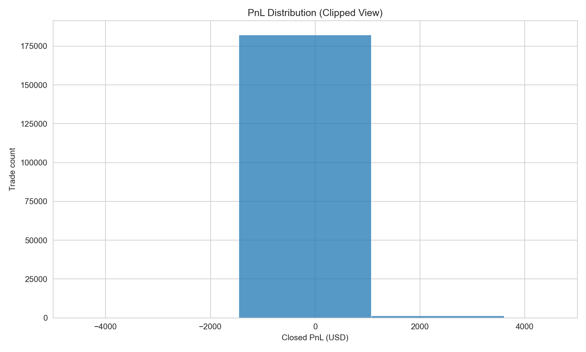
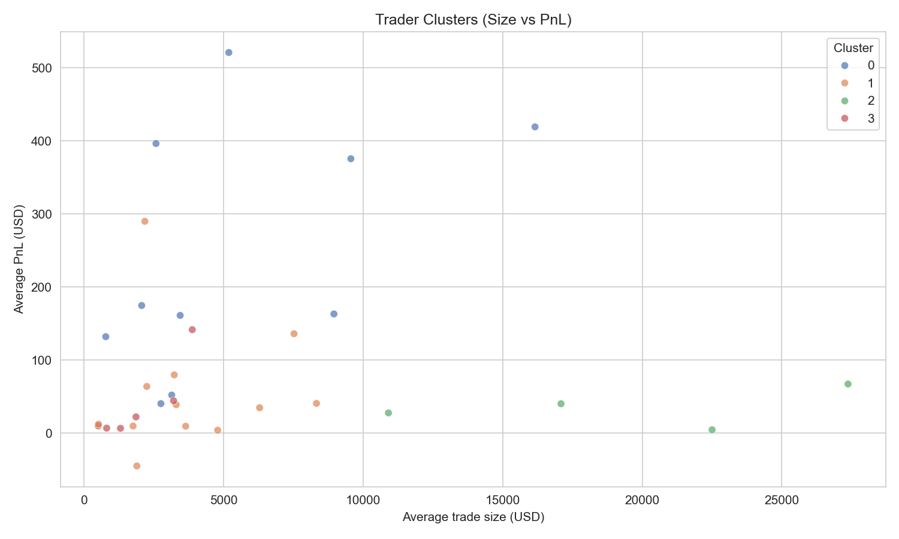
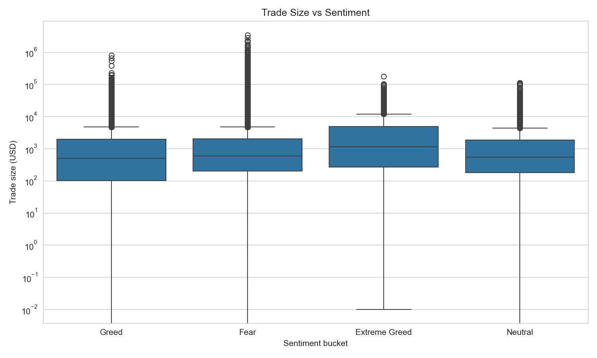
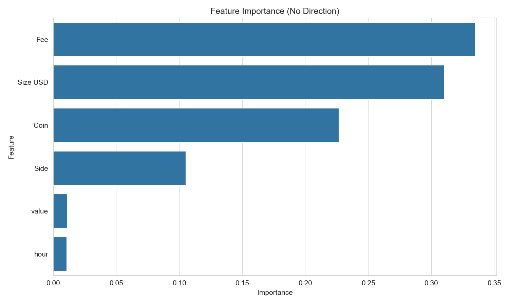

# Bitcoin Sentiment and Trader Behavior (Hyperliquid)

Short research notebook on how Bitcoin Fear and Greed relates to trading behavior on Hyperliquid. Focus is on sizing, profitability, and trader profiles rather than prediction hype.

## What Was Done
- Merged daily sentiment with trade-level history
- Analyzed profitability patterns and skewness
- Compared fear vs greed behavior
- Clustered trader types with KMeans
- Built a Random Forest classifier
- Detected and mitigated feature leakage

## Key Results
- Refined model accuracy: ~82% (after removing leaky `Direction`)
- Precision/recall roughly balanced for win/loss
- Profitability is heavily skewed to a small set of trades
- Greed regimes show fatter tails in trade sizing
- Sentiment adds context but is not the strongest driver

## Important Visualizations





## Tech Stack
Python 3.11, pandas, numpy, matplotlib, seaborn, scikit-learn, Jupyter

## Project Structure
```
crypto-sentiment-analysis/
├── data/
├── notebooks/
│   └── analysis.ipynb
├── report/
│   ├── pnl_distribution.png
│   ├── trade_size_vs_sentiment.png
│   ├── trader_clusters.png
│   └── feature_importance.png
├── requirements.txt
└── README.md
```

## Run Locally
1. Create and activate a Python 3.11 environment
2. `pip install -r requirements.txt`
3. Open `notebooks/analysis.ipynb`

## Final Conclusion
Sentiment relates to sizing and risk behavior, but the effect is not clean or monotonic. The most consistent signal is how traders react to regimes, not the sentiment score alone.
